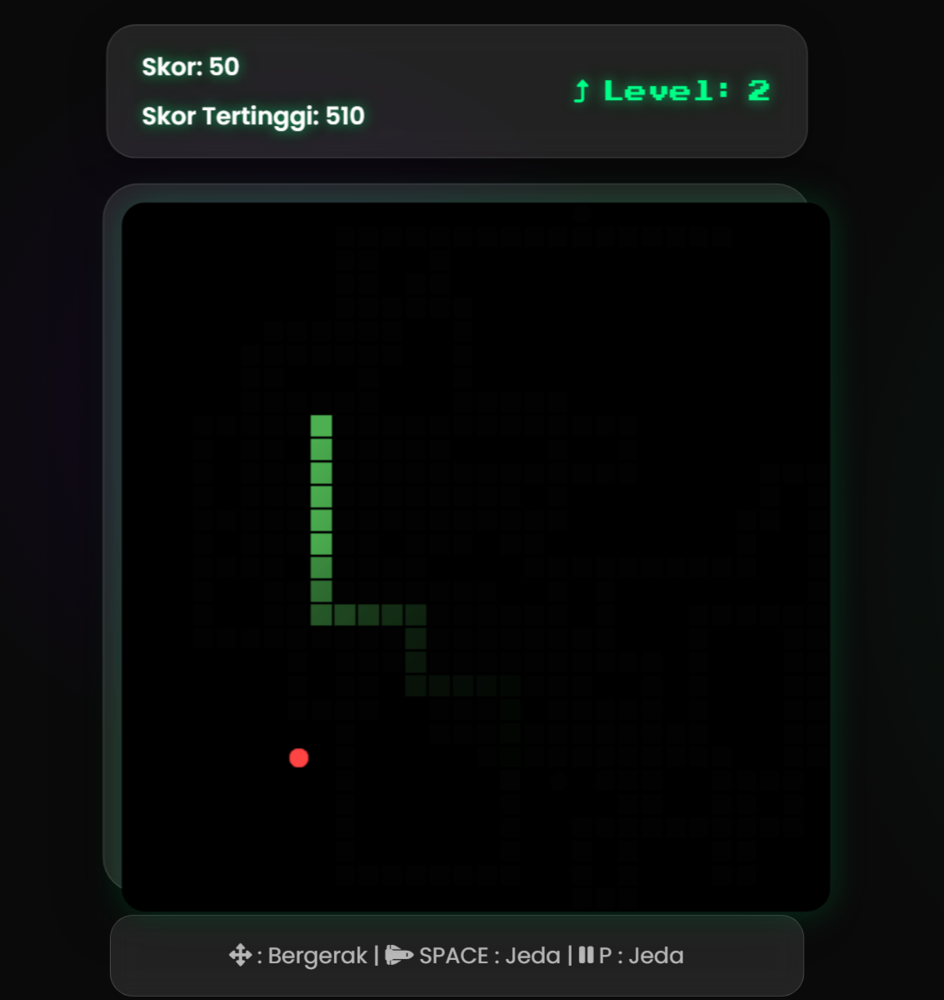

# 🐍 Classic Snake IO Game

Slither your way through this nostalgic Snake game where every apple brings growth and challenge! Test your reflexes and strategy as you navigate your snake to become longer and stronger while avoiding collisions.

## 🎮 Game Features

- 🍎 Collect apples to grow longer
- 📈 Score increases with each apple eaten
- 🏆 High score system to track your best performances
- 💀 Game over on wall or self collision
- 🎯 Progressive difficulty as snake length increases
- ⚡ Smooth snake movement controls

## 🎯 How to Play

1. Use arrow keys to control the snake:
   - ⬆️ Move Up
   - ⬇️ Move Down
   - ⬅️ Move Left
   - ➡️ Move Right

2. Game Objectives:
   - Eat apples to grow longer and increase your score
   - Avoid hitting walls
   - Dont collide with your own body
   - Aim for the highest score possible!

## 🚀 Getting Started

### Prerequisites

- Any modern web browser
- JavaScript enabled

### Installation

1. Clone the repository:
```bash
git clone https://github.com/rexzea/Snake-IO.git
```

2. Navigate to the game directory:
```bash
cd Snake-Game
```

3. Open `index.html` in your web browser to start playing

## 🎲 Gameplay Mechanics

### Scoring System
- Each apple eaten: +10 points
- High scores are automatically saved
- Challenge yourself to beat your personal best!

### Game Over Conditions
- Hitting any wall
- Colliding with snakes body
- Score is recorded if it beats the previous high score

## 🛠️ Built With

- HTML5 Canvas
- CSS3
- Vanilla JavaScript
- Lots of gaming passion! 🎮

## 📸 Preview



## 🔄 Future Updates

- Multiple difficulty levels

## 🤝 Contributing

Want to make the game even better? Contributions are welcome!

1. Fork the Project
2. Create your Feature Branch (`git checkout -b feature/NewFeature`)
3. Commit your Changes (`git commit -m 'Add some NewFeature'`)
4. Push to the Branch (`git push origin feature/NewFeature`)
5. Open a Pull Request

## 🎮 Controls Reference

| Key | Action |
|-----|--------|
| ↑   | Move Up |
| ↓   | Move Down |
| ←   | Move Left |
| →   | Move Right |
| Space | Pause Game |
| Enter | Restart Game |

## 📜 License

This project is licensed under the MIT License - see the [LICENSE](LICENSE) file for details.

## 📫 Contact

Email : faryfutz@gmail.com

No : +62 898-8610-455


## ⭐ Show Your Support

If you enjoyed the game:
- Give it a star ⭐
- Share it with fellow retro gaming fans
- Report any bugs you find
- Suggest new features

---
🎮 Happy Gaming! Created with 💚 by [Rexzea]
